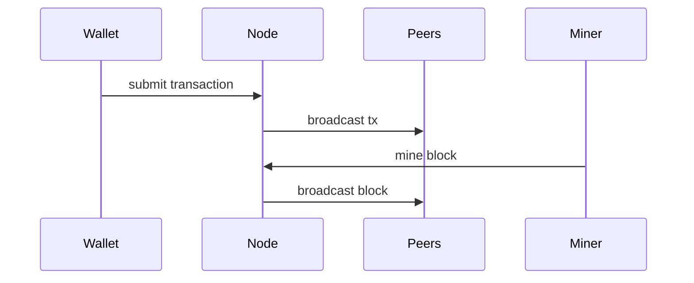

# LearnChain
A simplified blockchain learning project.

Modeled after Bitcoin. 
Networking is simplified to interactions between objects.
You can create wallets, nodes and miners.

Coins are created two ways: 
- each genesis block has a transfer of a certain FOUNDATION_AMOUNT to the foundation wallet.
- during mining, miners add coinbase transaction with a MINING_REWARD to their minerWallet.

A wallet updates the list of its UTXOs from the connected node's utxoset.
It creates transaction using its UTXO and submits it to the connected node.

The node verifies it and broadcasts it to its respective peer nodes.

Each node tracks its own local utxoset, mempool and blockchain.

A miner is a node's subclass. It takes transactions from its mempool, builds the block, mines the block, and broadcasts it to its peer nodes.

Peer nodes verify the block and broadcast it to their respective nodes.




## Installation
```bash
git clone https://github.com/markadeev/blockchain  
cd blockchain  
make  
```

## Usage
Edit main.cpp
```c++
// create node
Node node1;
Node node2;
// create miner
Miner miner1;

// connect nodes and miners
node1.addPeer(&node2);
node2.addPeer(&miner1);
miner1.addPeer(&node1);

// create a wallet with a connected node
Wallet wallet1(&node1);

// create a foundation wallet
Wallet foundationWallet(&node1);
// import foundation wallet private key
foundationWallet.importPrivateKeyPEM(FOUNDATION_PRIVKEY);

// create a transaction of 100 coins 
// from a foundationWallet to wallet1
// submit it to node1
foundationWallet.buildSubmitTransaction(wallet1.publicKey, 100);

// create, mine and broadcast new block
miner1.minerBroadcastBlock();

// select a node and print it's blockchain
node1.printBlockchain();
```

## Features

## Contributing
Pull requests are welcome.

## License
Open-source.
