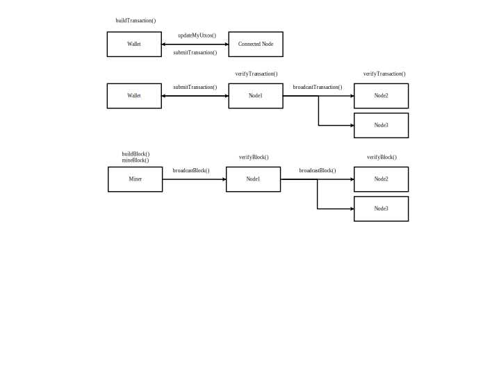

# LearnChain
A simplified blockchain learning project.

- Modeled after Bitcoin.  
- UTXO-based transaction model.  
- Networking is simplified to interactions between objects.  
- You can create wallets, nodes and miners, send transactions and mine blocks.  

Coins are created in two ways: 
- each node's blockchain has a genesis block with a foundation transaction.
- miners add mining reward to their minerWallet.

A wallet updates the list of its UTXOs from the connected node's utxoset.
It creates a transaction and submits it to the connected node.

That node verifies and broadcasts it to its respective peer nodes.

Each node tracks its own local utxoset, mempool and blockchain.

A miner is a node's subclass. It takes transactions from its mempool, builds the block, mines the block, and broadcasts it to its peer nodes.

Peer nodes verify the block and broadcast it to their respective peer nodes.



## Installation
```bash
git clone https://github.com/markadeev/blockchain  
cd blockchain  
make  
```

## Usage
To create objects and interact between them, open and edit src/main.cpp
```cpp
// create node
Node node1;
Node node2;
// create miner
Miner miner1;

// connect nodes and miners
node1.addPeer(&node2);
node2.addPeer(&miner1);
miner1.addPeer(&node1);

// create a wallet with a connected node
Wallet wallet1(&node1);

// create a foundation wallet
Wallet foundationWallet(&node1);
// import foundation wallet private key
foundationWallet.importPrivateKeyPEM(FOUNDATION_PRIVKEY);

// create a transaction of 100 coins 
// from a foundationWallet to wallet1
// submit it to node1
foundationWallet.buildSubmitTransaction(wallet1.publicKey, 100);

// create, mine and broadcast new block
miner1.minerBroadcastBlock();

// select a node and print it's blockchain
node1.printBlockchain();
```
## Example output
```text
Blockchain:
Block 0

| prevBlockHash: 0 |
| timestamp: 2026-01-28 18:40:21 |
| nonce: 0 |

| TxId: a065628ab5835464126db2995d9790eb63c518508106af716edf3acd369d2bf6 |

| txout.amount: 1000 |
| txout.publicKey:
-----BEGIN PUBLIC KEY-----
MFYwEAYHKoZIzj0CAQYFK4EEAAoDQgAEbqJNTPeXHOdqKbpFZwWjDyankHVx/TEO
tu2eMthSwBCHIHx0XiiSo3Jvyx2X/DnQOs9U3TNl2yQQmwfBaMlGsQ==
-----END PUBLIC KEY-----


Block 1

| prevBlockHash: 5c09649e3afddd091fd1a7aaa444e82358731c09e5c16bc6ad8a2f2ef13fab8b |
| timestamp: 2026-01-28 18:40:21 |
| nonce: 2250 |

| TxId: 90a45627d91b2336b7889a958ddb6a011de85a69fe6bf3bd973ca7a83e972300 |

| txin.prevTxId: a065628ab5835464126db2995d9790eb63c518508106af716edf3acd369d2bf6 |
| txin.prevTxIndex: 0 |

| txout.amount: 100 |
| txout.publicKey:
-----BEGIN PUBLIC KEY-----
MFYwEAYHKoZIzj0CAQYFK4EEAAoDQgAExJm2zpmCkuKvzD52DOtMWf6KDIN4n4lN
ws9AJxpNP2g7M9uN/eVKUOevxxhSUk4nUOzFbTOtttieiiUJrJDKqg==
-----END PUBLIC KEY-----

| txout.amount: 900 |
| txout.publicKey:
-----BEGIN PUBLIC KEY-----
MFYwEAYHKoZIzj0CAQYFK4EEAAoDQgAEbqJNTPeXHOdqKbpFZwWjDyankHVx/TEO
tu2eMthSwBCHIHx0XiiSo3Jvyx2X/DnQOs9U3TNl2yQQmwfBaMlGsQ==
-----END PUBLIC KEY-----


| TxId: a0db7ceeb4829ae9cd8d06590ab9bbdc67f2d111eff7ee105a0db44fcafa59db |

| txin.prevTxId: 0 |
| txin.prevTxIndex: 0 |

| txout.amount: 50 |
| txout.publicKey:
-----BEGIN PUBLIC KEY-----
MFYwEAYHKoZIzj0CAQYFK4EEAAoDQgAElEAgfx58VHDFjchpyU6KjLnnxjsOntxv
WbimTt9AmU3bWsOYqMEWIywQWYRsxOv40oyZjC0ONl6NzrduiY+OlQ==
-----END PUBLIC KEY-----
```
## Configuration
LearnChain can be configured via include/settings.h

FOUNDATION AMOUNT initial amount of coins in the genesis block for foundation wallet  
BLOCK_SIZE amount of transactions taken from the mempool and added to the block  
MINING_DIFFICULTY amount of leading zeroes required in the block hash  
MINING_REWARD reward paid to miners in the coinbase transaction  

## Contributing
Pull requests are welcome.

## License
[MIT](https://choosealicense.com/licenses/mit/)
